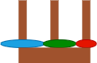

# Assignment 1 Hanoi towers in PROLOG
 **Zauriel Jesus Espejel Cervantes ID:171888**   
For the assignment 1 we have to code a hanoi towers algorithm in prolog
to execute run  
`tower_of_hanoi(N)` where N is the number of rings to have.

##  Example
First we have te initial state where all the rings are in the first tower.  
  
Move the first disk from initial to objective tower.  
  
Then move the second disk to auxiliar tower.  
  
After that move the first one to the top of the green one.  
  
Finally move the blue to the objective, so now the green one have to be moved on top of the blue one.  
  
But the red one is distrubing the green so move it to the frist tower.  

Now we can move the red one to the top of the blue one.  
  
And finally move the red one on top of the third tower.  
   

## Execution

